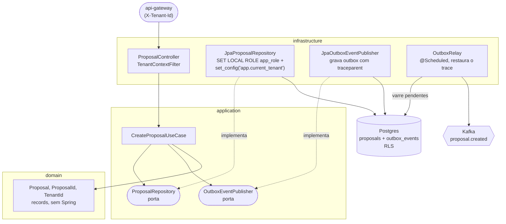

# C4 — Componentes do `proposal-service`

O `proposal-service` é o exemplo canônico da Clean Architecture aplicada em todos os serviços (ADR-0013): a dependência aponta sempre para dentro — a infraestrutura depende da aplicação (implementa as portas), e a aplicação depende do domínio.

