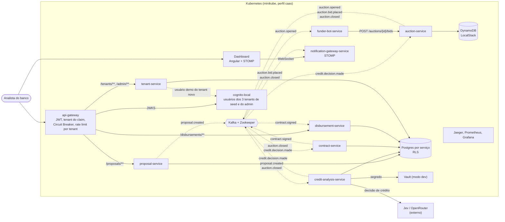

# C4 — Containers

Visão de containers no estilo C4, desenhada como fluxograma por legibilidade (o layout automático do `C4Container` do Mermaid sobrepõe rótulos com tantas relações). Setas tracejadas são eventos Kafka; setas contínuas são chamadas síncronas ou acesso a dados.

As NetworkPolicies (Calico) só admitem tráfego para `tenant-service`, `proposal-service` e `disbursement-service` vindo do `api-gateway`, e para o `auction-service` vindo do `funder-bot-service` ([ADR-0024](../adr/0024-kubernetes-statefulsets-helm-e-vault-em-modo-dev.md)); o gateway injeta o `X-Tenant-Id` a partir do claim do token ([ADR-0017](../adr/0017-autenticacao-com-cognito-emulado.md)). Todos os serviços exportam traces (OTLP) para o Jaeger e expõem métricas ao Prometheus (`obs`, ADR-0011); as setas foram omitidas para não poluir. Decomposição e dados por serviço: ADR-0012 e ADR-0016. O `credit-analysis-service` revalida o crédito quando o leilão fecha (etapa `POST_AUCTION`, ADR-0020).
