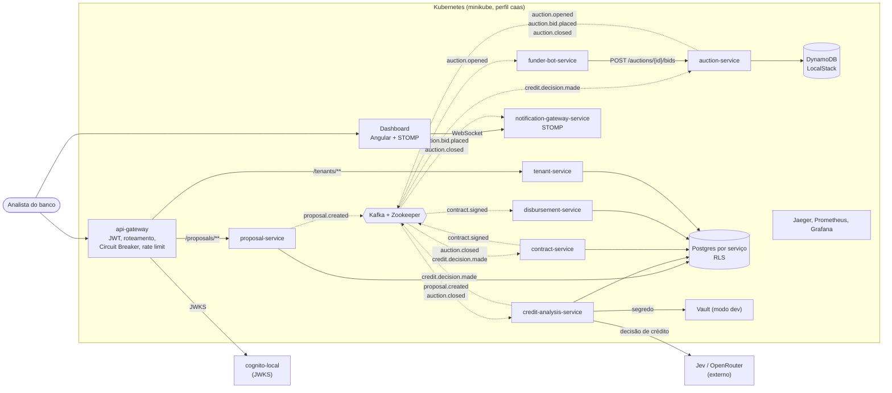

# C4 — Containers

Visão de containers no estilo C4, desenhada como fluxograma por legibilidade (o layout automático do `C4Container` do Mermaid sobrepõe rótulos com tantas relações). Setas tracejadas são eventos Kafka; setas contínuas são chamadas síncronas ou acesso a dados.

Todos os serviços exportam traces (OTLP) para o Jaeger e expõem métricas ao Prometheus (`obs`, ADR-0011); as setas foram omitidas para não poluir. Decomposição e dados por serviço: ADR-0012 e ADR-0016. O `credit-analysis-service` revalida o crédito quando o leilão fecha (etapa `POST_AUCTION`, ADR-0020).
