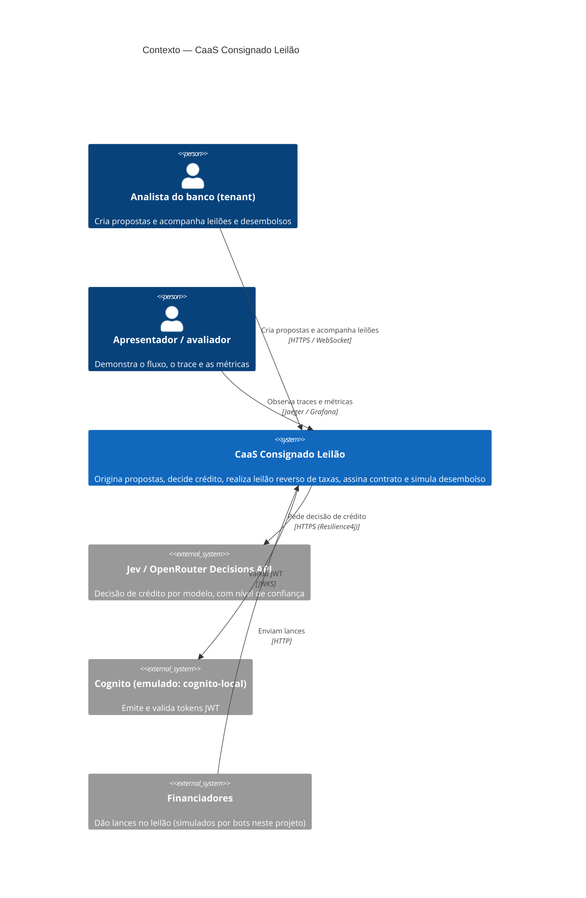

# C4 — Contexto do sistema

O CaaS Consignado Leilão é uma plataforma **simulada** de Credit-as-a-Service: bancos (tenants) originam propostas de crédito consignado, o sistema analisa o crédito e faz um leilão reverso entre financiadores até o desembolso.

Fronteiras honestas: o Jev só é chamado de verdade com `OPENROUTER_API_KEY` (perfil `jev`, ADR-0005); nos testes e no cluster local usa-se um adaptador simulado determinístico. Os financiadores são bots (ADR-0019).
