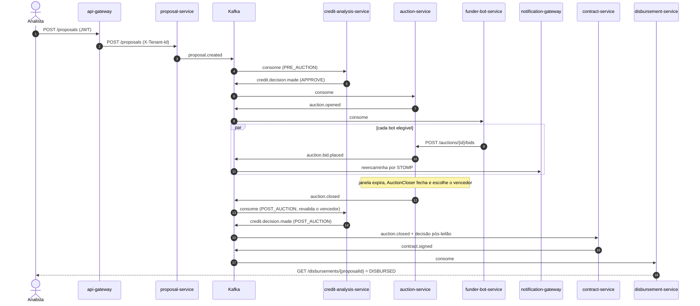

# Sequência — fluxo feliz (proposta → desembolso)

Toda publicação de evento passa pelo outbox transacional (ADR-0003); as setas para o Kafka já representam o relay. Um único trace atravessa toda a cadeia (ADR-0011).

