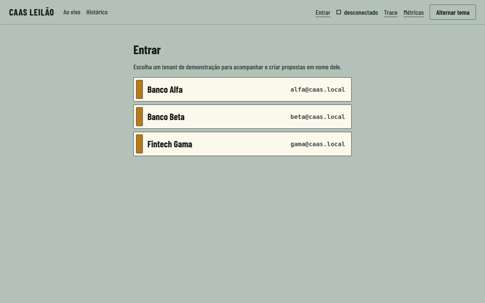
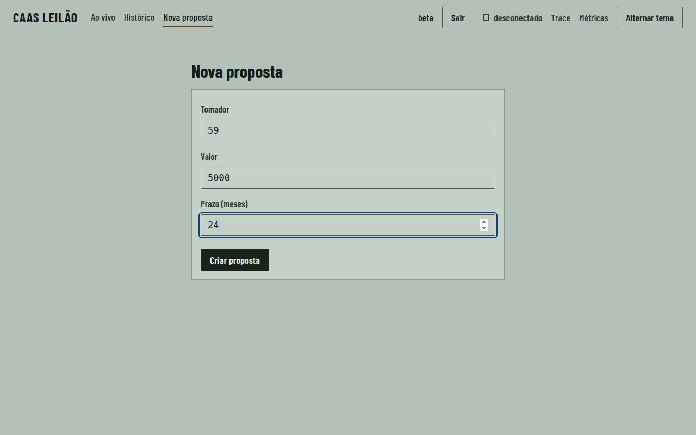
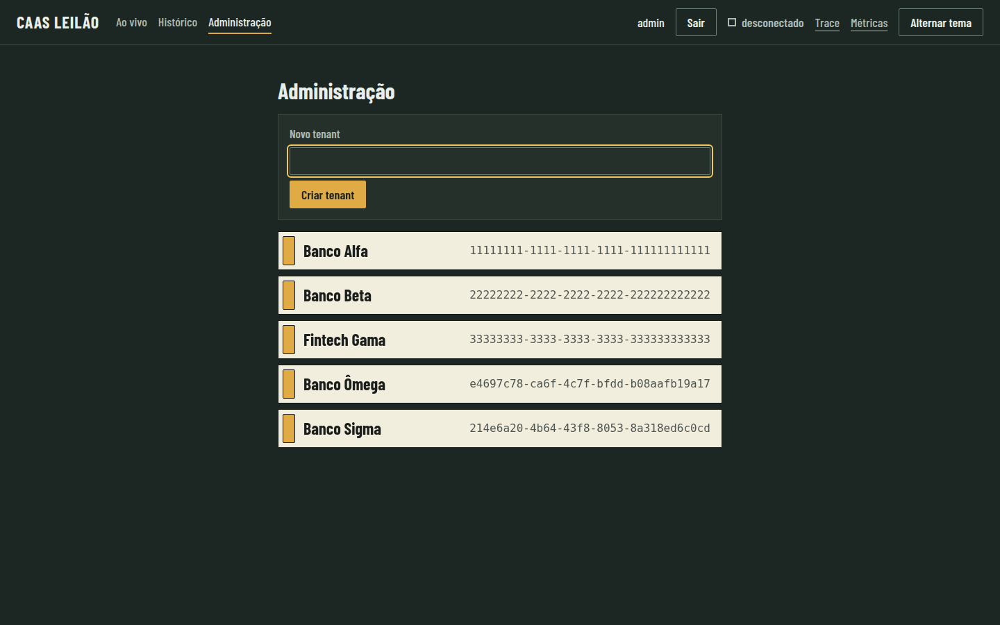
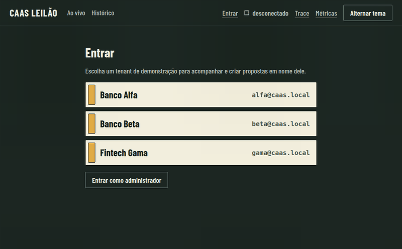
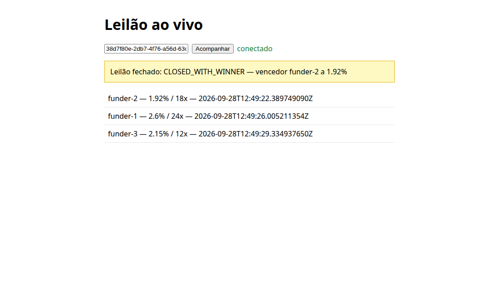
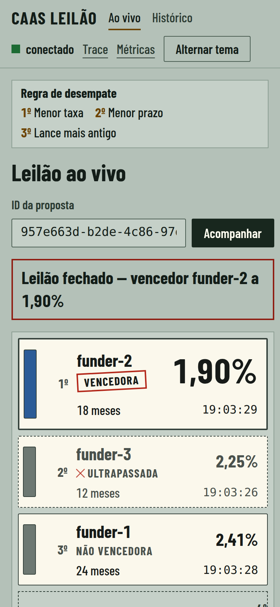
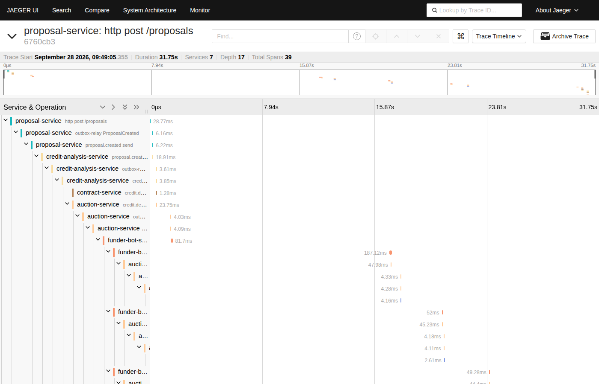
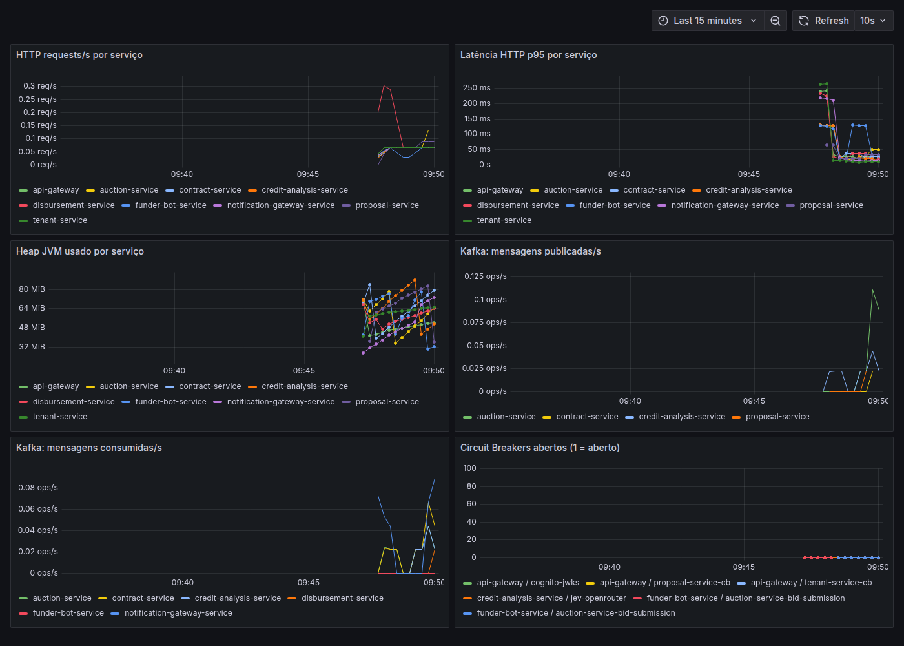

# Roteiro de demonstração

Roteiro para apresentar o sistema ao vivo (~15 min). **Todos os comandos abaixo foram executados de verdade** num cluster real (perfil minikube `caas`, 8 GiB), com as saídas observadas descritas em cada passo. Os tempos são aproximados.

Pré-requisitos: Docker, `minikube`, `kubectl`, `helm`, JDK 21 e Node 22; cerca de 8 GiB livres. O perfil `caas` sobe com o CNI Calico (necessário para NetworkPolicy); se ele foi criado antes dessa mudança, recrie-o uma vez com `minikube delete -p caas`. Em todo o roteiro, `IP` é o endereço do cluster:

```
IP=$(minikube -p caas ip)
```

## 1. Subir o cluster (~10 min na primeira vez)

```
make deploy-local
```

Compila os 9 serviços e o dashboard, sobe o minikube (perfil `caas`), instala Kafka + Zookeeper e Vault por Helm e aplica Postgres (um StatefulSet por serviço), LocalStack, os serviços, o stack de observabilidade, um `cognito-local` (com usuários `alfa@`, `beta@` e `gama@caas.local`, um por tenant de seed, e `admin@caas.local`, o administrador da plataforma) e as NetworkPolicies. Termina quando todos os pods estão `Ready` (23 pods `1/1`).

## 2. Fluxo feliz completo, com prova de observabilidade (~1 min)

```
make smoke-test
```

Obtém tokens reais do `cognito-local`, cria uma proposta **pelo gateway** e espera o desembolso, verificando no caminho o isolamento entre tenants. Saída esperada (resumida):

```
tokens obtidos (tenants alfa e beta)
proposal created: {"id":"…","borrowerId":"59","requestedAmount":5000.00,"termMonths":24,"status":"PENDING_CREDIT_ANALYSIS"}
ISOLAMENTO OK: header forjado ignorado; dono=200, outro tenant=404
AUTH OK: sem token = 401
NETPOLICY OK: acesso direto ao proposal-service bloqueado
DISBURSEMENT FOUND:
{"proposalId":"…","funderId":"funder-2","amount":5000.00,"status":"DISBURSED",…}
TRACE OK (…): api-gateway auction-service contract-service credit-analysis-service disbursement-service funder-bot-service notification-gateway-service proposal-service
PROMETHEUS OK: 9 alvos up
GRAFANA OK: dashboard 'CaaS Overview' provisionado
```

O que isso prova: a proposta entrou pela borda pública autenticada, atravessou todos os serviços por eventos, o leilão escolheu um vencedor (`funder-2`, ver [ADR-0018](adr/0018-mecanismo-de-leilao-e-desempate.md)), o contrato foi assinado e o desembolso ficou consultável; e **um único trace** cobre a cadeia inteira.

## 3. Isolamento entre tenants (~2 min)

O tenant vem do **claim `custom:tenant_id` do token**, nunca de um header do cliente ([ADR-0017](adr/0017-autenticacao-com-cognito-emulado.md)). `make token` emite um ID token do usuário de um tenant de seed (`TENANT_USER=alfa|beta|gama`):

```
TOKEN_A=$(make -s token)                        # alfa@caas.local, Banco Alfa
TOKEN_B=$(make -s token TENANT_USER=beta)       # beta@caas.local, Banco Beta

# Alfa cria uma proposta tentando forjar o tenant de Beta no header:
ID=$(curl -s -X POST http://$IP:30080/proposals \
  -H "Authorization: Bearer $TOKEN_A" -H 'X-Tenant-Id: 22222222-2222-2222-2222-222222222222' \
  -H 'Content-Type: application/json' -d '{"borrowerId":"59","requestedAmount":5000.00,"termMonths":24}' \
  | sed -n 's/.*"id":"\([^"]*\)".*/\1/p')

curl -s -o /dev/null -w '%{http_code}\n' http://$IP:30080/proposals/$ID -H "Authorization: Bearer $TOKEN_A"   # 200
curl -s -o /dev/null -w '%{http_code}\n' http://$IP:30080/proposals/$ID -H "Authorization: Bearer $TOKEN_B"   # 404
curl -s -o /dev/null -w '%{http_code}\n' http://$IP:30080/proposals/$ID                                        # 401
```

Saída observada: `200` (o dono lê — o header forjado foi ignorado, senão receberia 404), `404` (o outro tenant não enxerga a proposta, pela RLS) e `401` (sem token). O acesso direto ao serviço interno, contornando o gateway, é barrado pela NetworkPolicy:

```
kubectl run probe -n caas --rm -i --restart=Never --image=curlimages/curl:latest --command -- \
  sh -c 'curl -s --max-time 5 http://proposal-service:8080/actuator/health || echo "BLOQUEADO (sem resposta em 5s)"'
```

Saída observada: `BLOQUEADO (sem resposta em 5s)`. (Um pod com o label do gateway, ou o próprio gateway, alcança o serviço normalmente — é o que o fluxo feliz faz.)

## 3b. Entrar e criar a proposta pelo dashboard (sem terminal)

Abra `http://$IP:30090/#/entrar`, escolha um tenant (Banco Alfa, Banco Beta ou Fintech Gama) e vá em **Nova proposta**: preencha tomador, valor e prazo e clique em **Criar proposta**. A tela leva direto ao acompanhamento do leilão da proposta recém-criada. O login usa `POST /auth/login` no gateway (ADR-0028); **Sair** limpa a sessão.





### Administração de tenants (Milestone 17)

Em `http://$IP:30090/#/entrar`, use **Entrar como administrador** e abra **Administração**: a lista mostra todos os tenants e o formulário **Criar tenant** cadastra um banco novo e o usuário demo dele (ADR-0029). Saia, volte a **Entrar**: o tenant criado aparece na lista (neste navegador) e já permite criar propostas.





**Isolamento no tempo real (ADR-0030).** O WebSocket exige o ID token e os tópicos são por tenant. Com a proposta de Banco Alfa em andamento, entre como Banco Beta e abra `#/?proposta=<id da proposta de Alfa>`: a tela conecta, mas não recebe nenhum lance (o servidor só publica no tópico do tenant dono do leilão e recusa a assinatura do tópico de outro). Verificado no cluster real: `CONNECT` sem token e com token inválido dão `ERROR`; Beta assinando o tópico de Alfa recebe `ERROR`; origem `http://evil.example` é recusada (403) no WebSocket e no preflight do gateway.

O mesmo fluxo pela API (o papel vem do claim `custom:role` do token, ADR-0029):

```
login() { curl -s -X POST http://$IP:30080/auth/login -H 'Content-Type: application/json' -d "{\"tenant\":\"$1\"}" | sed -n 's/.*"idToken":"\([^"]*\)".*/\1/p'; }
ADMIN=$(login admin)
curl -s -X POST http://$IP:30080/admin/tenants -H "Authorization: Bearer $ADMIN" -H 'Content-Type: application/json' -d '{"name":"Banco Ômega"}'   # 201
NOVO=$(login banco-omega)                                                                                                                      # o usuário demo já existe
curl -s -o /dev/null -w '%{http_code}\n' http://$IP:30080/admin/tenants -H "Authorization: Bearer $(login alfa)"   # 403: tenant comum
curl -s -o /dev/null -w '%{http_code}\n' http://$IP:30080/proposals/x -H "Authorization: Bearer $ADMIN"            # 403: admin não vê dados de tenant
```


## 4. Leilão ao vivo no dashboard (~2 min)

Os bots dão lance de 0,5 a 3 s depois de o leilão abrir, rápido demais para abrir a tela. Para a demonstração, atrase os bots:

```
kubectl set env deploy/funder-bot-service -n caas APP_FUNDER_BOT_MIN_DELAY_MS=10000 APP_FUNDER_BOT_MAX_DELAY_MS=25000
kubectl rollout status deploy/funder-bot-service -n caas
```

Abra `http://$IP:30090` (dashboard Angular) e crie uma proposta pelo gateway:

```
curl -s -X POST http://$IP:30080/proposals \
  -H "Authorization: Bearer $(make -s token)" -H 'Content-Type: application/json' \
  -d '{"borrowerId":"59","requestedAmount":5000.00,"termMonths":24}'
```

Copie o `id` da resposta para o campo "ID da proposta" e clique em **Acompanhar** (o indicador de conexão vira "conectado"). Cada lance entra no rack como uma tira, na posição que a regra de desempate lhe dá (menor taxa, depois menor prazo, depois lance mais antigo, impressa no painel à esquerda); a líder ocupa a tira grande, e quem já liderou e foi superado ganha "Ultrapassada" com a cruz de caneta. Em 10–25 s os três lances aparecem ao vivo; a janela do leilão é de 45 s e, ao fechar, a vencedora recebe o carimbo "Vencedora", as demais viram "Não vencedora" ou "Ultrapassada", e uma linha de status confirma o resultado. Exemplo observado: `Leilão fechado — vencedor funder-2 a 1,90%`. Sem cluster, o botão "Ver com dados simulados" (ou `?demo` na URL) roda uma história fixa; o selo "Modo demonstração" fica sempre visível e o Histórico marca a execução como simulada.



No celular (a partir de 320 px), as tiras viram duas linhas e a regra de desempate fica compacta:



Injeção manual de lance (o mesmo endpoint dos bots, [ADR-0019](adr/0019-financiadores-simulados-como-servico.md)), enquanto o leilão está aberto:

```
kubectl port-forward -n caas svc/auction-service 8082:8080
curl -s -X POST localhost:8082/auctions/<proposalId>/bids -H 'Content-Type: application/json' \
  -d '{"funderId":"funder-1","rate":1.5,"termMonths":24}'
```

Saída observada: `HTTP 200` com o leilão atualizado; ao fechar (`GET /auctions/<proposalId>`), `CLOSED_WITH_WINNER` com vencedor `funder-1` — o lance manual de 1,5% venceu os bots (~2,0–2,6%).

Ao terminar, restaure os bots:

```
kubectl set env deploy/funder-bot-service -n caas APP_FUNDER_BOT_MIN_DELAY_MS- APP_FUNDER_BOT_MAX_DELAY_MS-
```

## 5. O trace no Jaeger (~2 min)

Abra `http://$IP:30686`, escolha o serviço `proposal-service` e abra o trace de `http post /proposals`. Ele mostra uma árvore conectada de **7 serviços e 39 spans (profundidade 17)** — do `POST` inicial, passando pelo outbox (`outbox-relay ProposalCreated`), pelos consumidores Kafka, pelos lances dos bots por HTTP e pelo fechamento do leilão, até o desembolso. Como a raiz é a requisição, os saltos assíncronos ficam sob ela graças ao `traceparent` guardado no outbox ([ADR-0011](adr/0011-observabilidade-traces-e-metricas.md)).



## 6. Métricas no Grafana (~1 min)

Abra `http://$IP:30300/d/caas-overview` (acesso anônimo somente leitura): taxa e latência p95 de HTTP, heap por serviço, mensagens Kafka publicadas e consumidas, e o estado dos Circuit Breakers.



## 7. Degradação graciosa: Jev indisponível (~2 min)

Aponte a decisão de crédito para o provedor Jev com uma URL inalcançável (simula a queda do provedor):

```
kubectl set env deploy/credit-analysis-service -n caas APP_CREDIT_DECISION_PROVIDER=jev APP_JEV_DECISIONS_URL=http://localhost:1/decisions
kubectl rollout status deploy/credit-analysis-service -n caas
```

Crie uma proposta (comando do passo 4) e leia a decisão publicada no Kafka:

```
kubectl exec -n caas kafka-broker-0 -- /opt/bitnami/kafka/bin/kafka-console-consumer.sh \
  --bootstrap-server localhost:9092 --topic credit.decision.made --from-beginning --timeout-ms 8000 | grep <proposalId>
```

Saída observada: `{"proposalId":"…","decision":"MANUAL_REVIEW","confidence":0.0,"stage":"PRE_AUCTION",…}` — o sistema **não quebra**: a falha do provedor vira revisão manual e nenhum leilão é aberto ([ADR-0020](adr/0020-trava-de-confianca-e-degradacao-do-credito.md)). Volte ao normal:

```
kubectl set env deploy/credit-analysis-service -n caas APP_CREDIT_DECISION_PROVIDER- APP_JEV_DECISIONS_URL-
```

A chamada real ao Jev (com `OPENROUTER_API_KEY`) é o `demo-smoke` do CI e não faz parte deste roteiro ([ADR-0005](adr/0005-integracao-jev-openrouter-e-vault.md)).

## 8. Encerrar

```
make k8s-down
```

Remove o namespace e desliga o perfil `caas`. Para o loop rápido de desenvolvimento, sem Kubernetes, use `make up` / `make down`.
